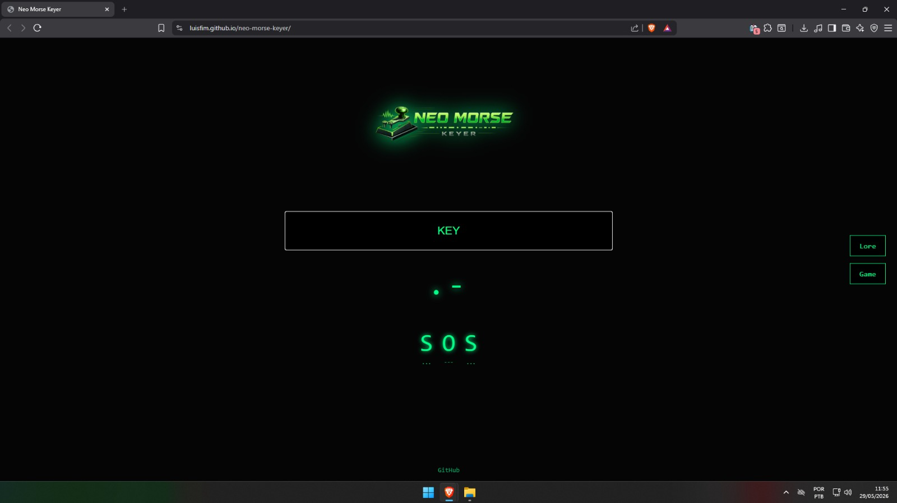

# Neo Morse Keyer

A modern interactive Morse code terminal built with HTML, CSS and JavaScript.

Neo Morse Keyer allows users to generate Morse code through keyboard timing, decode letters and numbers, and explore the history of one of the earliest digital communication system.

## Live Demo

Visit the project here:

https://luisfim.github.io/neo-morse-keyer/

